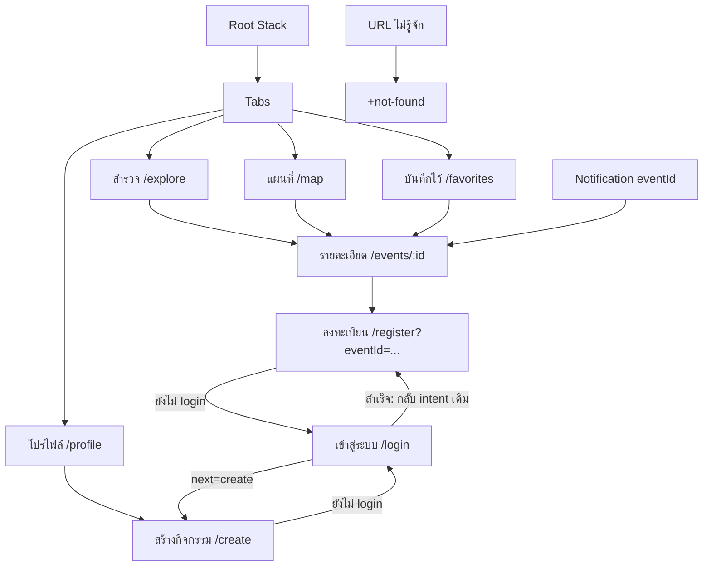
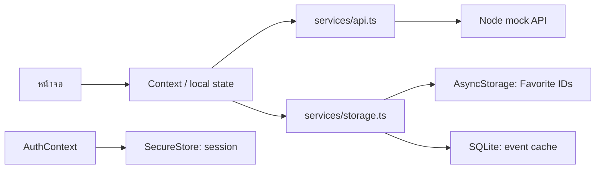
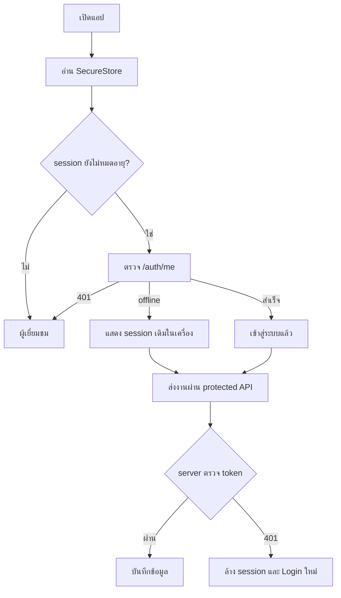
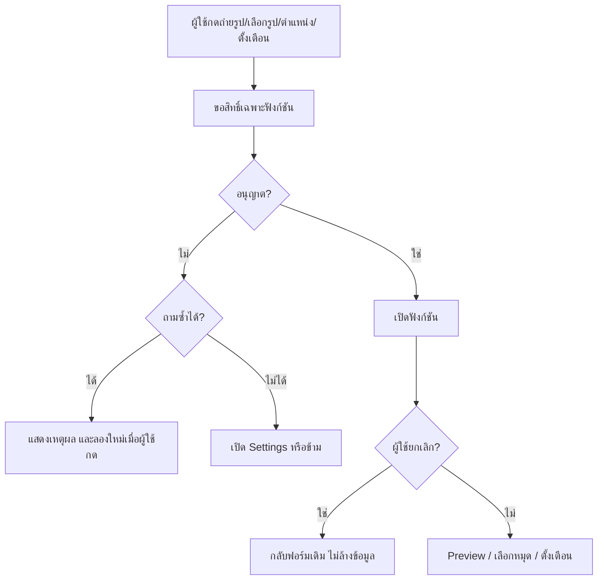
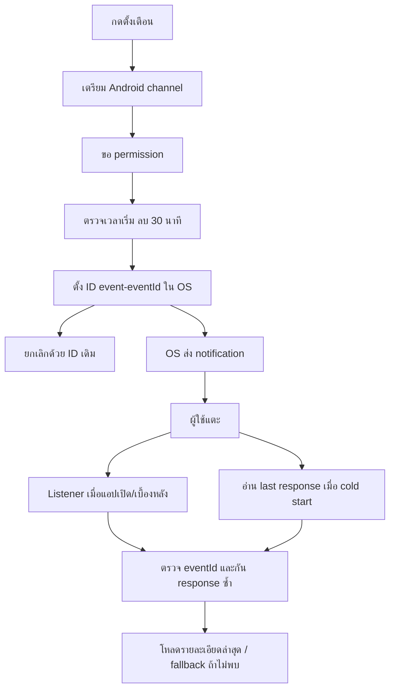

# โครงสร้างระบบและเหตุผลที่เลือก

โค้ดแบ่งตามหน้าที่: `app` ดูแลหน้าจอ, `components` ดูแลส่วนที่ใช้ซ้ำ, `context` ดูแล state ร่วม และ `services` ดูแลข้อมูล/อุปกรณ์ ใช้รูปแบบธรรมดาเพื่อให้อ่านตามได้ง่าย

## Route diagram

ตัวอย่าง deep link ใน Development Build: `nongkhai://events/bridge` ใช้ ID หา event ไม่ส่ง object ผ่าน URL หากไม่พบแสดง fallback โดยไม่ crash

## State ownership

| ข้อมูล                           | เจ้าของ                             | เหตุผล                                             |
| -------------------------------- | ----------------------------------- | -------------------------------------------------- |
| รายการกิจกรรมและ cache timestamp | AppContext                          | หน้ารายการ แผนที่ และรายละเอียดใช้ร่วมกัน          |
| Favorite IDs                     | AppContext                          | ปุ่มหัวใจทุกหน้าต้องตรงกัน                         |
| session และ auth readiness       | AuthContext                         | ป้องกันหน้าที่ต้อง login และไม่กระพริบก่อน restore |
| search/category                  | EventList                           | เฉพาะการค้นหาบนหน้านั้น                            |
| filtered events/count            | คำนวณจาก state                      | ไม่เก็บ derived state ซ้ำ                          |
| ฟอร์ม/รูป draft/พิกัด            | Create/Register screen              | เก็บเฉพาะระหว่างกรอก ส่งเมื่อ submit               |
| request loading/error            | หน้าจอหรือ context ที่เริ่ม request | แสดง feedback ตรงจุด                               |

ตัวอย่าง updater: `setRetry(value => value + 1)` อ้างอิง state ล่าสุด ส่วนการเปลี่ยน Favorite สร้าง array ใหม่แทนการแก้ array เดิม ใช้ custom hooks `useApp()` และ `useAuth()` เพื่อเข้าถึง Context; ไม่จำเป็นต้องใช้ reducer ถ้า state ยังไม่ซับซ้อน

## Storage matrix และ lifecycle

| ข้อมูล                                | ที่เก็บ                     | ล้าง/หมดอายุเมื่อ                                              |
| ------------------------------------- | --------------------------- | -------------------------------------------------------------- |
| Favorite IDs                          | AsyncStorage                | ผู้ใช้กดนำออก; เป็นข้อมูลเฉพาะเครื่อง ไม่ผูกบัญชีสาธิต         |
| Event list, image data URL, updatedAt | SQLite                      | Pull-to-refresh สำเร็จจะแทน cache ทั้งชุด หรือผู้ใช้ล้าง cache |
| token/name/email/expiry               | SecureStore                 | Logout, expiry หรือ API ตอบ 401                                |
| ฟอร์มและ URI ชั่วคราว                 | component state             | ออกจากหน้า; API error ปกติยังคงค่าที่กรอก                      |
| reminder IDs                          | OS notification scheduler   | ยกเลิก หรือ notification ถูกส่ง; ID กำหนดจาก event ID          |
| กิจกรรม/ลงทะเบียน                     | `server/data/database.json` | ผู้ดูแลจัดการไฟล์สาธิตของตน                                    |
| API sessions                          | server memory               | Logout/expiry/server restart                                   |

Favorite hydrate เสร็จก่อนให้กดแก้ และไม่เขียน array ว่างทับข้อมูลระหว่างเริ่มต้น Cache เสียแต่ละแถวจะถูกข้าม รูปออนไลน์อาจโหลดไม่ได้ตอน offline จึงแสดง placeholder; รูปที่สร้างเป็น data URL จะอยู่ใน cache ด้วย แผนที่ฐานยังต้องใช้บริการแผนที่/tiles และไม่ได้รับประกันการแสดง tiles ขณะ offline

## API contract

ทุก response เป็น JSON; error เป็น `{ "message": "ข้อความ" }`

| Method / path         | Auth         | Request / ผลลัพธ์                                   |
| --------------------- | ------------ | --------------------------------------------------- |
| GET `/health`         | ไม่ต้อง      | `{ ok: true }`                                      |
| GET `/events`         | ไม่ต้อง      | `Event[]`                                           |
| GET `/events/:id`     | ไม่ต้อง      | `Event` หรือ 404                                    |
| POST `/auth/login`    | ไม่ต้อง      | `{email,password}` → `{token,name,email,expiresAt}` |
| GET `/auth/me`        | Bearer token | `{name,email}` หรือ 401                             |
| POST `/auth/logout`   | Bearer token | revoke token → `{ok:true}`                          |
| POST `/registrations` | Bearer token | `{eventId,name,email,guests}` → Registration        |
| POST `/events`        | Bearer token | EventDraft → Event                                  |

ดู field ของ Event/Registration ที่ `src/types/event.ts` API ตรวจชนิด/ขนาดข้อมูล จำนวนคน วันเวลา พิกัด และ JPEG/PNG signature ซ้ำฝั่ง server ทุกครั้ง ไม่เชื่อ validation ของหน้าจออย่างเดียว

Registration ใช้บัญชี + event ID เป็นเงื่อนไขซ้ำ เมื่อ retry จะคืนรายการเดิม (ไม่แก้จำนวนจากรายการเดิม) เพื่อป้องกันการลงทะเบียนซ้ำจาก network interruption หน้าจอมี ref lock ป้องกันกด submit ซ้ำด้วย

`api.ts` ตรวจ `response.ok`, parse JSON, validate Event shape และ timeout 12 วินาที List/Detail ยกเลิก request ที่ไม่ใช้แล้ว; refresh เก่าไม่ทับผลของ request ใหม่

## Authentication และ authorization

Threat checklist:

- token อยู่ใน SecureStore ไม่อยู่ใน AsyncStorage หรือ source
- ไม่ log token หรือ password ที่ผู้ใช้กรอก; API แสดงเฉพาะบัญชีสาธิตสุ่มครั้งเริ่ม server
- Protected API ตรวจ token เสมอ การซ่อนหน้าจอไม่ใช่ authorization
- Logout revoke token ฝั่ง server เมื่อออนไลน์ และล้างในเครื่อง; ถ้า offline token ฝั่ง server หมดอายุตามเวลา
- ตรวจ payload, ขนาดรูปและ file signature ฝั่ง server
- ไม่ส่ง contact, token หรือพิกัดส่วนตัวใน notification payload
- จำกัดการลอง login ผิด 10 ครั้งต่อนาทีต่อ IP
- `.env` และข้อมูลลงทะเบียนไม่เข้า Git
- API นี้ใช้ HTTP บน LAN เพื่อสาธิตเท่านั้น Production ต้อง HTTPS, ฐานข้อมูลจริง, บัญชีหลายผู้ใช้และการจัดเก็บรหัสผ่านแบบ hash
- session restore ขณะ offline แสดงโปรไฟล์เดิมได้ แต่ไม่ได้ข้าม authorization ที่ server

## Permission flow

| ฟังก์ชัน      | Android                                | iOS                             | Fallback                         |
| ------------- | -------------------------------------- | ------------------------------- | -------------------------------- |
| กล้อง         | Camera permission                      | Camera usage description        | เลือกจากคลัง/ไม่แนบรูป           |
| คลังภาพ       | ตามระบบ picker/permission ของ SDK      | Photo library usage description | ข้าม/ลองใหม่/Settings            |
| ตำแหน่ง       | Foreground เท่านั้น                    | When In Use เท่านั้น            | แตะแผนที่เลือกจุด                |
| แผนที่สถานที่ | Google Maps, native build ต้อง API key | Apple Maps                      | เปิดรายละเอียดข้อความได้         |
| แจ้งเตือน     | Channel + permission ตาม OS            | Notification permission         | ไม่ตั้งเตือนและเปิดรายละเอียดเอง |

Privacy: ตำแหน่งปัจจุบันขอเมื่อกดเท่านั้น ไม่มี background tracking หมุดในฟอร์มจะถูกส่งเป็นจุดนัดพบเมื่อกดสร้างกิจกรรม รูปกับจุดนัดพบเป็นข้อมูลสาธารณะของกิจกรรม ไม่เก็บประวัติการเดินทาง

## Notification lifecycle

ตัวแจ้งเตือนเก็บเฉพาะ event ID และข้อความทั่วไป ตรวจ ID ก่อนนำทาง รอ root navigation พร้อมก่อนเปิดหน้า วันเวลาที่กรอกตีความเป็นเวลาไทยแล้วเก็บ ISO UTC ปุ่มทดสอบ 10 วินาทีใช้คนละ ID กับ reminder หลัก
