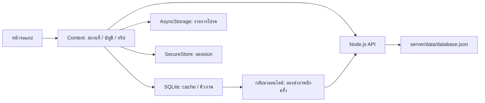

# โครงสร้าง Nong Khai Trip

## เส้นทางผู้ใช้

ดูขั้นตอนและ Flow ล่าสุดใน [คู่มือใช้งาน](USER_GUIDE.md)

## State และข้อมูล

| ข้อมูล               | เจ้าของ / ที่เก็บ                              |
| -------------------- | ---------------------------------------------- |
| สถานที่และรายการโปรด | AppContext; SQLite cache และ AsyncStorage IDs  |
| บัญชีและ token       | AuthContext; SecureStore                       |
| ทริปของเจ้าของบัญชี  | TripContext; API และ SQLite cache แยกตาม owner |
| ภาพความทรงจำรอส่ง    | SQLite ตาราง pending; ID คงเดิมเมื่อลองส่งซ้ำ  |
| ฟอร์มชื่อและเวลา     | local state ของหน้าฟอร์ม                       |
| ภาพก่อนกดบันทึก/โทน  | local state ใน TripCamera                      |
| reminder             | OS scheduler; identifier ผูกกับ trip ID        |

รูปความทรงจำเขียนลง SQLite ก่อนส่ง API เมื่อส่งสำเร็จลบรายการรอส่ง; การตอบกลับ API ใช้ ID ภาพเดิมเพื่อไม่เพิ่มซ้ำ หลัง restart จะนำภาพรอส่งกลับมาแสดงร่วมกับ cache การ Login จำเป็นสำหรับทริป แต่ไม่จำเป็นสำหรับสำรวจสถานที่ Token หมดอายุให้ Login ใหม่

ออกจากบัญชีแล้วไม่แสดง cache ของเจ้าของเดิม ข้อมูลในเครื่องยังคงแยกตาม owner เพื่อคืนข้อมูลเมื่อ Login บัญชีเดิม การลบทริปต้องยืนยันและเรียก API สำเร็จก่อนล้างข้อมูลทริป/รูปที่รอส่งในเครื่อง

## API

| Method | Path                     | หน้าที่                                           |
| ------ | ------------------------ | ------------------------------------------------- |
| GET    | `/health`                | ตรวจ server                                       |
| GET    | `/places`, `/places/:id` | อ่านสถานที่                                       |
| POST   | `/auth/login`            | รับ session จำลอง                                 |
| GET    | `/auth/me`               | ตรวจ session                                      |
| POST   | `/auth/logout`           | ยกเลิก session                                    |
| GET    | `/trips`, `/trips/:id`   | อ่านเฉพาะทริปของผู้ใช้                            |
| POST   | `/trips`                 | สร้างทริปด้วย ID จาก client เพื่อ retry โดยไม่ซ้ำ |
| PATCH  | `/trips/:id`             | แก้ชื่อ เวลา และลำดับ placeIds                    |
| DELETE | `/trips/:id`             | ลบทริปและภาพของทริป                               |
| POST   | `/trips/:id/memories`    | เพิ่มภาพด้วย ID ที่ retry ได้                     |

API ตรวจ token และ owner ทุกเส้นทางทริป ตรวจชื่อ วันที่ สถานที่ซ้ำ/ไม่มีจริง และชนิด/ขนาดรูป ไฟล์ข้อมูลถูกเขียนผ่านไฟล์ชั่วคราวและ rename; session อยู่ใน memory จึงหมดอายุเมื่อ restart server

ยังเก็บ route เพิ่มสถานที่เดิม `/create` และ POST `/places` สำหรับงานแผนที่/การเลือกหมุด ไม่ใช่เส้นทางหลักสร้างทริป

## แผนรายวัน

`startsAt` และ `endsAt` เป็นเวลาเริ่มและกลับ; `placeDays` กำหนดวันของแต่ละสถานที่ ส่วน `stopTimes` เป็นเวลาเที่ยวที่เลือกภายหลัง ล้างเวลาแล้ววันของสถานที่ยังอยู่ API ปฏิเสธวันที่หรือเวลานอกช่วงทริป และย้ายข้อมูลรุ่นเดิมโดยอนุมานวันกลับจากเวลาเที่ยวล่าสุด

## Notification และ permission

เวลาในฟอร์มเป็นเวลาไทย แปลงเป็น ISO UTC ในข้อมูล แต่ละสถานที่มี `stopTimes` ระบุ `placeId`, `startsAt`, `endsAt` เวลาเริ่มต้องไม่ก่อนเริ่มทริปและเวลาสิ้นสุดต้องหลังเวลาเริ่ม ตั้งเตือนตามเวลาเริ่มของแต่ละสถานที่ในอนาคต (สูงสุด 50 รายการต่อทริป) การแก้ตารางหรือชื่อทริปจะยกเลิกและตั้งเตือนใหม่ถ้าเคยเปิดเตือน; ถ้าไม่มีเวลาในอนาคตจะแสดงให้ผู้ใช้ตั้งใหม่ การลบทริปยกเลิก reminder

Notification เก็บ tripId และ placeId สำหรับการเตือนรายสถานที่ ตัวทดสอบเก็บ tripId ตรวจรูปแบบ ID รอ navigation พร้อม และนำไปยังรายละเอียดหรือ Login ตาม session รองรับ listener และ last response สำหรับ cold start

ปุ่มทดลองแจ้งเตือนตั้ง local notification ใน 10 วินาทีด้วย ID แยกจากการเตือนจริง กดซ้ำแทนที่การทดสอบเดิมและแตะเพื่อเปิดทริปได้

ขอ camera เมื่อเปิดถ่ายรูป ขอเพิ่มรูปลงคลังเฉพาะตอนกดบันทึกลงมือถือ ตำแหน่งเป็น foreground เท่านั้น ไม่มีการติดตามเบื้องหลัง แผนที่ฐานและภาพออนไลน์อาจไม่แสดงตอน offline แต่ข้อความและรูปความทรงจำที่บันทึกแล้วอ่านจาก cache ได้

## ข้อมูลเก็บที่ไหน / ออฟไลน์ทำอะไรได้

- ออนไลน์: สร้าง/แก้ไข/ลบทริป และส่งข้อมูลไป API
- ออฟไลน์: อ่านข้อมูลที่เคยโหลด เก็บรายการโปรด และเพิ่มรูปในทริปเดิมได้เมื่อ session ยังไม่หมดอายุ
- รูปรอส่งเก็บใน SQLite ก่อน ลองส่งใหม่เมื่อออนไลน์ กลับเข้าแอป หรือกดโหลดใหม่
- แผนที่ฐานและรูปสถานที่ออนไลน์อาจไม่แสดงเมื่อไม่มีเน็ต
- ข้อมูลทริป/cache แยกเจ้าของบัญชี รายการโปรดเก็บในอุปกรณ์
