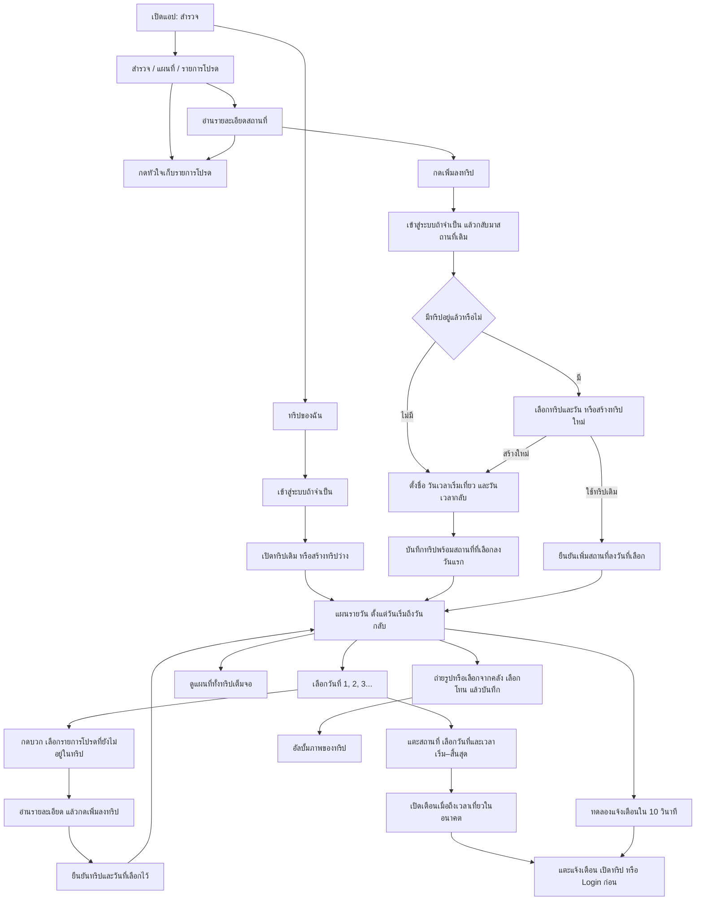

# คู่มือใช้งาน Nong Khai Trip

[← กลับ README](../README.md)

## ระบบทำอะไรได้บ้าง

| หน้า              | การใช้งาน                                                                               |
| ----------------- | --------------------------------------------------------------------------------------- |
| สำรวจ             | ค้นหาชื่อ/อำเภอ กรองหมวดหมู่ แตะหัวใจเพื่อเก็บสถานที่                                   |
| บันทึกไว้         | ดูสถานที่โปรดที่เก็บไว้บนมือถือ                                                         |
| รายละเอียดสถานที่ | อ่านข้อมูล ดูตำแหน่ง และกด **เพิ่มลงทริป** — ปุ่มนี้อยู่ที่หน้ารายละเอียด               |
| ทริปของฉัน        | สร้าง/แก้ไข/ลบทริป เลือกวันเวลาเริ่มเที่ยวและวันกลับ ดูจำนวนวัน/คืน                     |
| แผนการเดินทาง     | แท็บวันที่ 1, 2, 3… ครบทุกวัน แต่ละวันเลือกสถานที่จาก **รายการโปรดที่ยังไม่อยู่ในทริป** |
| เวลาเที่ยว        | เลือกวันที่หนึ่งครั้ง พร้อมเวลาเริ่ม–สิ้นสุด รายการที่ยังไม่มีเวลาแสดงพื้นเขียวอ่อน     |
| แผนที่            | ดูหมุดสถานที่ ตำแหน่งปัจจุบัน และแผนที่ทั้งทริปแบบเต็มจอ                                |
| ภาพความทรงจำ      | ถ่ายรูป/เลือกจากคลัง เลือกโทน เก็บในทริป และบันทึกลงคลังมือถือ                          |
| โปรไฟล์           | เข้าสู่ระบบ ออกจากระบบ และดูจำนวนทริปของฉัน                                             |

สถานที่หนึ่งเพิ่มได้หนึ่งครั้งต่อทริป เปลี่ยนวันของสถานที่ได้จากหน้าเลือกเวลา การเอาหัวใจออกไม่ลบสถานที่ที่เพิ่มลงทริปแล้ว ส่วนการเพิ่มผ่านหน้ารายละเอียดทั่วไปยังเลือกทริปและวันได้โดยตรง

## Flow การใช้งาน

การกดหัวใจบันทึกรายการโปรดได้โดยไม่ต้อง Login และไม่ได้เปิดหน้า Login อัตโนมัติ ระบบจะขอเข้าสู่ระบบเมื่อสร้างหรือจัดการทริป แล้วกลับมาทำขั้นตอนเดิมต่อ

สร้างทริปว่างจากหน้าทริปของฉันได้โดยตั้งชื่อ วันเวลาเริ่มเที่ยวและวันกลับ ไม่บังคับเลือกสถานที่ก่อน รายการที่ยังไม่ตั้งเวลาอยู่ในวันที่เลือกและแสดงพื้นเขียวอ่อน ส่วนการตั้งเตือนและเพิ่มภาพเป็นทางเลือก

**ตัวอย่าง:** เริ่มเที่ยว 24 ก.ย. กลับ 26 ก.ย. → ระบบสร้าง 3 วัน 2 คืน → เลือกวันที่ 2 → เพิ่มสถานที่โปรด → สถานที่แสดงในวันที่ 2 ทันที → กำหนดเวลา 10:00–12:00 ภายหลัง ล้างเวลาแล้วสถานที่ยังอยู่วันที่ 2

## ทดลองแจ้งเตือน

1. ล็อกอินและเปิดทริปใดก็ได้ ไม่ต้องตั้งเวลาเที่ยวก่อน
2. กด **ทดลองแจ้งเตือนใน 10 วินาที** และอนุญาตสิทธิ์แจ้งเตือน
3. ปิดกล่องข้อความ แล้วรอ 10 วินาที ทดลองได้ทั้งขณะเปิดแอปและกลับหน้าหลักมือถือ
4. แตะข้อความแจ้งเตือน ระบบควรเปิดทริปเดิม
5. กดทดลองซ้ำจะเริ่มนับใหม่ ไม่สะสมรายการทดสอบของทริปนั้น

ปุ่มทดลองใช้ local notification แยกจากตารางเที่ยวจริง ส่วนปุ่ม **เตือนเมื่อถึงเวลาเที่ยว** ต้องมีเวลาเที่ยวในอนาคตก่อน หากไม่เห็นแจ้งเตือนให้ตรวจสิทธิ์และโหมดห้ามรบกวนของมือถือ ต้องทดสอบการแสดง banner/เสียงบนเครื่องจริง
